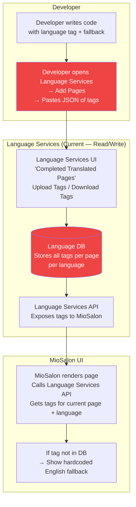
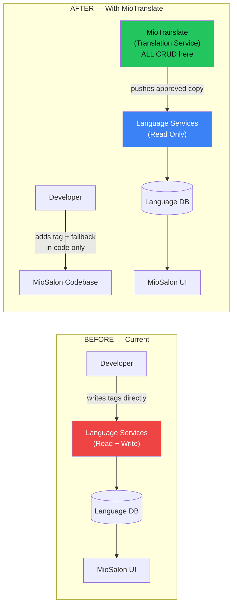
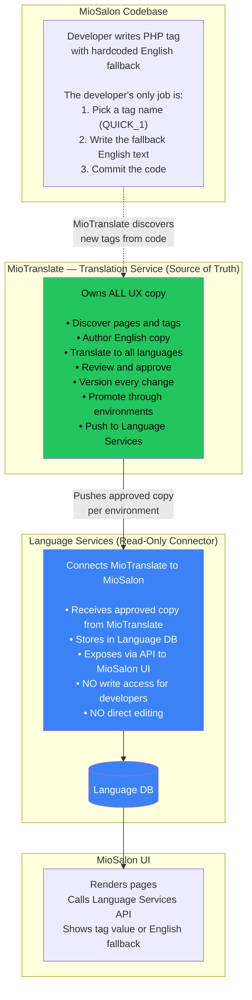
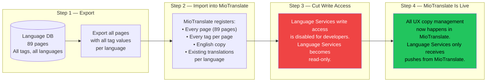
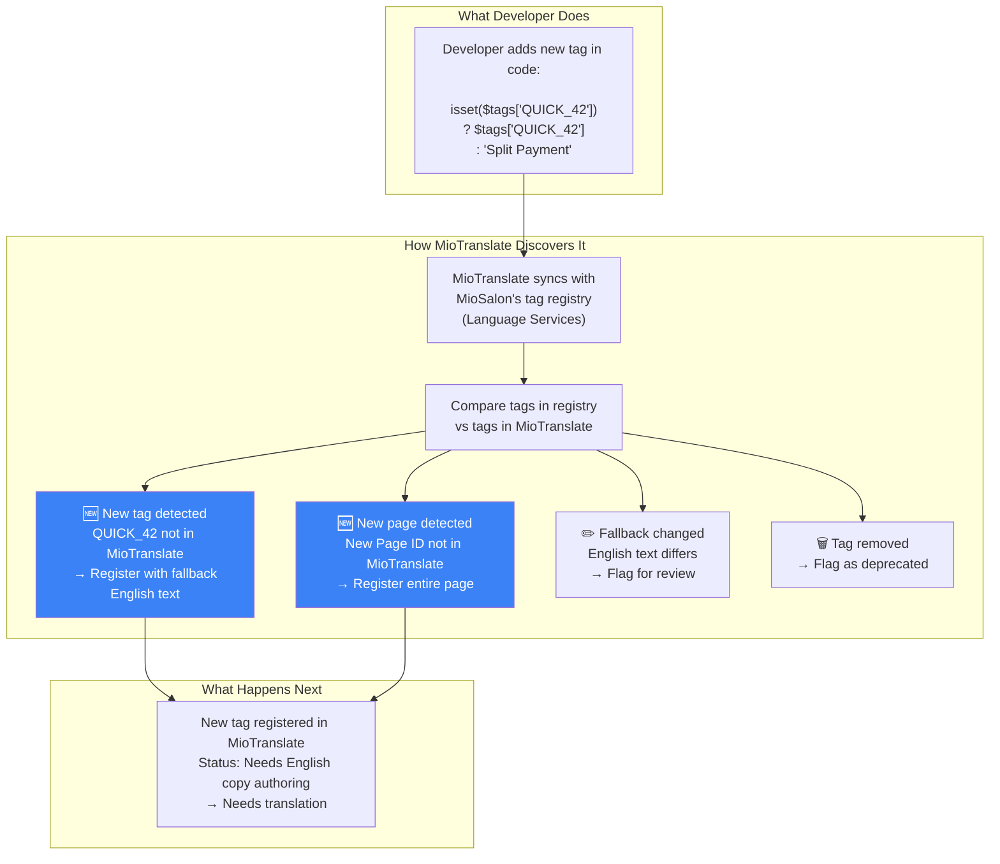
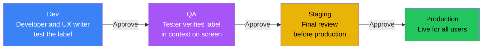
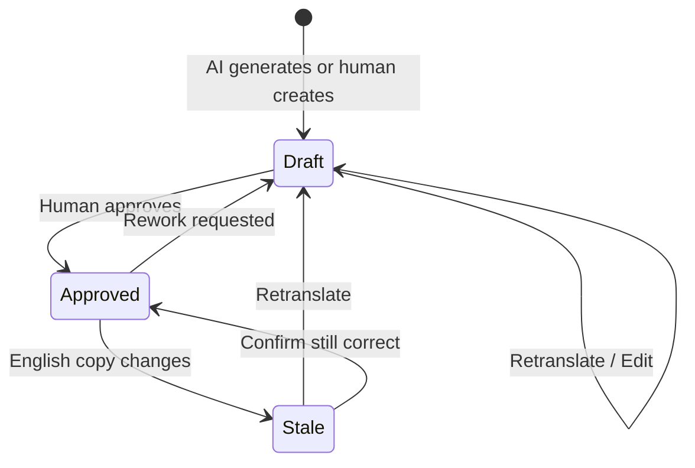
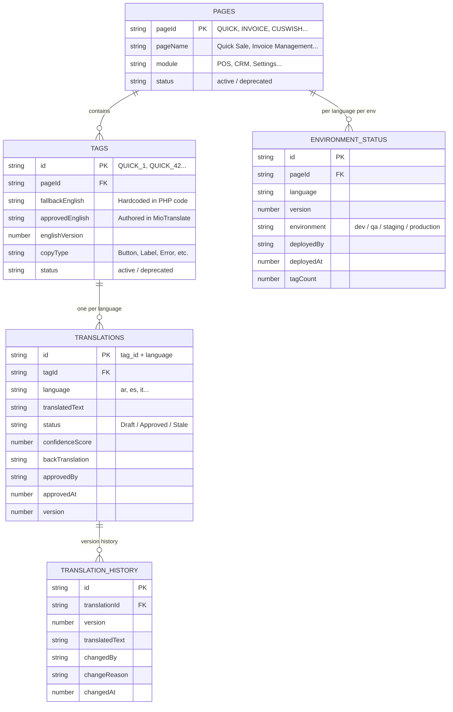

# MioTranslate — Complete System Design v3

## The Single Source of Truth for All MioSalon UX Copy

---

**Product:** MioTranslate (Translation Service)  
**Document Type:** System Design — Full Picture  
**Version:** 3.0  
**Audience:** Founding Team, Product, Engineering  
**Date:** August 2026  

---

## Table of Contents

1. [How MioSalon Works Today](#1-how-miosalon-works-today)
2. [What Changes — The Architectural Shift](#2-what-changes--the-architectural-shift)
3. [The Three Systems and Their Roles](#3-the-three-systems-and-their-roles)
4. [The Migration — Day One](#4-the-migration--day-one)
5. [Page Discovery — How MioTranslate Stays in Sync](#5-page-discovery--how-miotranslate-stays-in-sync)
6. [How a Label Moves Through the System](#6-how-a-label-moves-through-the-system)
7. [Environment Pipeline — Dev, QA, Staging, Production](#7-environment-pipeline--dev-qa-staging-production)
8. [Language Isolation](#8-language-isolation)
9. [Workflows — Every Scenario](#9-workflows--every-scenario)
10. [Data Model](#10-data-model)
11. [What MioTranslate Becomes](#11-what-miotranslate-becomes)
12. [Risks](#12-risks)

---

## 1. How MioSalon Works Today

### The Tag System

Every piece of text in MioSalon's UI is rendered through a **language tag**. The developer writes PHP code like this:

```php
<span><?php print isset($tags['QUICK_1']) ? $tags['QUICK_1'] : "Quick Sale"; ?></span>
```

What this means:
- `QUICK_1` is the **language tag** — a unique identifier for this specific label.
- `"Quick Sale"` is the **fallback** — the hardcoded English text shown if the tag is not found in the database.
- `$tags['QUICK_1']` looks up the tag from the **Language Services DB**. If a value exists (in any language), it shows the DB value instead of the fallback.

### Pages and Tags

UX copy is organized by **pages**. Each page has a **Page ID** and contains multiple tags.

Example — the **Upcoming Wishes** page:

| Page Name | Page ID |
|---|---|
| Upcoming Wishes | `CUSWISH` |

Tags for this page:

```json
{
  "@type": "document",
  "@version": 0,
  "CUSWISH_10": "Type",
  "CUSWISH_11": "Please choose festival type",
  "CUSWISH_FEMALE": "Female",
  "CUSWISH_MALE": "Male",
  "CUSWISH_18": "Loading…",
  "CUSWISH_19": "No Record",
  "CUSWISH_16": "Gender",
  "CUSWISH_17": "Date",
  "CUSWISH_6": "Period",
  "CUSWISH_14": "Mobile Number",
  "CUSWISH_5": "Please choose duration",
  "CUSWISH_15": "Email-ID",
  "CUSWISH_4": "Duration",
  "CUSWISH_12": "Search",
  "CUSWISH_13": "Customer Name",
  "CUSWISH_28": "Birthday",
  "CUSWISH_29": "Anniversary",
  "CUSWISH_23": "Next 7 days",
  "CUSWISH_24": "Next 15 days",
  "CUSWISH_25": "Next 30 days",
  "CUSWISH_26": "Custom range"
}
```

Every tag follows the pattern: `{PAGE_ID}_{TAG_NUMBER}` — like `CUSWISH_10`, `CUSWISH_FEMALE`, etc.

### The Current Architecture



**The problem with this architecture:**
- Developer has **read AND write** access to Language Services DB.
- UX copy is edited directly in the database — no versioning, no approval, no audit trail.
- Tags are uploaded manually via a text box in the multilingual access area (Page ID + Tag JSON) — no quality checks. Downloads come as Excel files.
- No one knows what the current state of translations is across pages and languages.
- One wrong paste can break a page's copy in production.

### What 89 Pages Looks Like

MioSalon has **89 pages** in the language registry. Examples:

| Page ID | Page Name | Module |
|---|---|---|
| QUICK | Quick Sale Point of Sale | POS |
| INVOICE | Invoice Management | POS |
| CUSWISH | Upcoming Wishes | CRM |
| CUSINS | Customer Insights | Reporting |
| APPOINT | Appointment Management | Calendar |
| STAFFSET | Staff Management | Staff |
| MEMBSET | Membership Management | Settings |
| SERSET | Service Management | Settings |
| PREPSET | Prepaid Wallet Management | Settings |
| FEEDBK | Feedback & Reviews | CRM |
| ... | ... (79 more pages) | ... |

Each page has anywhere from 10 to 100+ tags. All of these need English copy management + multilingual translations.

---

## 2. What Changes — The Architectural Shift

### The Founder's Whiteboard

This diagram — drawn by the founder — defines the target architecture:


### The Shift in One Sentence

**Language Services stops being the place where UX copy is managed. MioTranslate takes over. Language Services becomes a read-only pass-through.**

### Before and After



| What | Before | After |
|---|---|---|
| **Where English UX copy is authored** | Developer pastes JSON into Language Services | Authored and managed in MioTranslate |
| **Where translations are created** | Manual spreadsheet, pasted as JSON | AI-assisted in MioTranslate with context + review |
| **Who can write to Language DB** | Developers (direct access) | Only MioTranslate (via controlled injection) |
| **Language Services role** | Read + Write store for UX copy | Read-only pass-through between MioTranslate and MioSalon |
| **Versioning** | `@version: 0` in JSON — never incremented | Full version history per page per language |
| **Approval before production** | None — paste and it's live | Dev → QA → Staging → Production with approval gates |
| **Audit trail** | None — who changed what is unknown | Every change tracked: who, when, what, why |

---

## 3. The Three Systems and Their Roles



| System | Role | Who Uses It |
|---|---|---|
| **MioSalon Codebase** | Developer adds tag references in PHP code with English fallback text. The code only says: "for this label, use tag X, and if tag X doesn't exist, show this English text." | Engineers |
| **MioTranslate (Translation Service)** | The single source of truth. All UX copy discovery, authoring, translation, review, versioning, and promotion happens here. | Product, Localization team, Reviewers |
| **Language Services** | A read-only connector. Receives approved copy from MioTranslate. Stores it in Language DB. MioSalon UI reads from it. Developers **cannot** write to it. | MioSalon UI (read-only) |

---

## 4. The Migration — Day One

Before MioTranslate goes live, every existing page and tag from Language Services is migrated into MioTranslate. This is a one-time, full migration.



**What gets migrated:**
- All 89 pages with their Page IDs and Page Names.
- Every tag within each page, with its English text.
- Every existing translation (Arabic, Spanish, Italian, etc.) if available.
- Migrated translations enter MioTranslate as **Published in Production** (they're already live).

**What happens after migration:**
- Developer can no longer open Language Services and paste JSON.
- Developer can no longer edit tags directly in the Language DB.
- All changes to UX copy — English or any translation — go through MioTranslate.

---

## 5. Page Discovery — How MioTranslate Stays in Sync

After migration, MioTranslate needs to know when:
- A developer adds a **new page** (new Page ID in the codebase).
- A developer adds a **new tag** to an existing page (new `QUICK_42` in the code).
- An existing tag's **fallback English text** changes.

### How Discovery Works



### Discovery Methods

| Method | How It Works | When To Use |
|---|---|---|
| **Sync on demand** | User clicks "Sync" in MioTranslate. MioTranslate reads all pages and tags from Language Services (read-only) and compares with its own registry. Shows diff: new pages, new tags, changed fallbacks, removed tags. | Default method. Run before starting a translation session. |
| **Developer notifies** | Developer submits a ticket or fills a form in MioTranslate: "I added 5 new tags to page QUICK." MioTranslate pulls just that page and registers the new tags. | For urgent or known additions. |
| **Automated sync** | Periodic sync (daily or on code merge) that automatically detects changes. | Future enhancement. Not needed for MVP. |

### What MioTranslate Shows After Sync

| Page | Total Tags | In MioTranslate | New | Changed | Removed |
|---|---|---|---|---|---|
| QUICK | 38 | 36 | 2 new | 0 | 0 |
| INVOICE | 45 | 45 | 0 | 1 changed | 0 |
| CUSWISH | 22 | 22 | 0 | 0 | 0 |
| LOYALTY (new page) | 15 | 0 | 15 new | 0 | 0 |

The user sees exactly what's new and takes action page by page.

---

## 6. How a Label Moves Through the System

This is the complete journey of a single label — from the moment a developer writes it in code to the moment a salon owner in Dubai sees it in Arabic.

> **Fallback text is not the source of English copy.** The developer writes a fallback (e.g., `"Split Payment"`) purely as a placeholder for testing in the Dev environment. In production, the fallback should never appear — success means the tag is found in Language Services and the copy comes entirely from the Translation Service (MioTranslate). English copy is authored fresh in MioTranslate, independent of whatever the developer typed as a fallback.

```mermaid
flowchart TD
    subgraph "1 — Developer writes code"
        D1["Developer adds in PHP:<br/><br/>isset($tags['QUICK_42'])<br/>? $tags['QUICK_42']<br/>: 'Split Payment'<br/><br/>Fallback is just a dev<br/>placeholder for testing"]
    end

    subgraph "2 — MioTranslate discovers it"
        M1["Sync detects QUICK_42<br/>as a new tag on page QUICK"]
        M1 --> M2["Tag registered in MioTranslate<br/>Dev fallback noted for reference"]
    end

    subgraph "3 — English copy is authored"
        E1["UX writer authors the<br/>official English copy in MioTranslate<br/>(e.g., 'Split Bill')"]
        E1 --> E2["English copy approved ✅<br/>This is the authoritative text —<br/>not the dev fallback"]
    end

    subgraph "4 — Translation"
        T1["AI translates 'Split Bill'<br/>with business context:<br/>POS screen, financial action,<br/>splitting total across methods"]
        T1 --> T2["Accuracy verification:<br/>back-translation, semantic check,<br/>confidence score"]
    end

    subgraph "5 — Review"
        R1["Reviewer sees translation<br/>+ evidence + confidence"]
        R1 --> R2{"Approve?"}
        R2 -->|"Yes"| R3["Approved ✅"]
        R2 -->|"Retranslate"| T1
        R2 -->|"Edit"| R4["Manual correction"]
        R4 --> R3
    end

    subgraph "6 — Environment promotion"
        ENV1["Deploy to Dev ✅"]
        ENV1 --> ENV2["Test → Deploy to QA ✅"]
        ENV2 --> ENV3["Test → Deploy to Staging ✅"]
        ENV3 --> ENV4["Final approval → Deploy to Production ✅"]
    end

    subgraph "7 — Live"
        L1["MioTranslate pushes<br/>to Language Services"]
        L1 --> L2["MioSalon UI loads<br/>QUICK_42 from Language Services<br/>Fallback never appears"]
        L2 --> L3["Salon owner in Dubai<br/>sees 'تقسيم الفاتورة'<br/>on the POS screen"]
    end

    D1 --> M1
    M2 --> E1
    E2 --> T1
    T2 --> R1
    R3 --> ENV1
    ENV4 --> L1

    style R3 fill:#22c55e,color:#000
    style ENV4 fill:#22c55e,color:#000
    style L3 fill:#22c55e,color:#000
```



---

## 7. Environment Pipeline — Dev, QA, Staging, Production

Every label goes through a strict promotion pipeline. Nothing skips from Dev to Production.

### The Pipeline



### What "Deploy" vs "Publish" Means

| Term | What It Means |
|---|---|
| **Approved** | A translation is reviewed and signed off in MioTranslate. It's correct. |
| **Deployed to Dev** | The approved label is pushed to the Dev environment's Language Services. Developers can see it on the Dev build of MioSalon. |
| **Deployed to QA** | The label is pushed to QA. Testers verify it appears correctly on the right screen, in the right context. |
| **Deployed to Staging** | The label is in the final pre-production environment. Last check before going live. |
| **Deployed to Production** | The label is live. Every MioSalon user sees it. |

### Dashboard — Where Every Label Lives

MioTranslate shows the environment status for every label on every page:

**Page: QUICK (Quick Sale POS) — Arabic**

| Tag | English | Arabic Translation | Dev | QA | Staging | Prod |
|---|---|---|---|---|---|---|
| QUICK_1 | Quick Sale | البيع السريع | ✅ | ✅ | ✅ | ✅ |
| QUICK_2 | Walk-in Customer | عميل بدون موعد | ✅ | ✅ | ✅ | ✅ |
| QUICK_42 | Split Bill | تقسيم الفاتورة | ✅ | ✅ | 🔵 Pending | — |
| QUICK_43 | Loyalty Points | — | 🟡 Draft | — | — | — |

At a glance: QUICK_42 is approved through QA and waiting for Staging approval. QUICK_43 is still in Draft on Dev.

### Promotion Rules

| Rule | What It Means |
|---|---|
| A label must be approved in the current environment before promotion to the next. | Can't skip from Dev to Production. |
| Promotion is per page per language. | Promoting QUICK Arabic to QA does not promote QUICK Spanish. |
| The whole page bundle moves together within an environment. | When you deploy QUICK Arabic to QA, all approved Arabic labels for that page are pushed together. |
| Rollback = redeploy previous version. | If a bad label reaches Staging, redeploy the previous Staging version. |

---

## 8. Language Isolation

Each language is independently managed. No operation on one language cascades to another.

| Rule | What It Means |
|---|---|
| **Edit isolation** | Editing Arabic for QUICK_1 does not touch Spanish, Italian, or any other language. |
| **Version isolation** | Page QUICK Arabic is at v5, QUICK Spanish is at v3. They are independent. |
| **Environment isolation** | QUICK Arabic can be in Production while QUICK Italian is still in Dev. |
| **Stale isolation** | If English changes, each language is independently flagged as Stale. Spanish may be resolved today, Arabic next week. |

### Three States Per Label Per Language



| State | Meaning | Impact |
|---|---|---|
| **Draft** | Generated by AI or entered by human. Not approved. | Cannot be deployed to any environment. |
| **Approved** | Reviewed and approved. | Can be deployed through the environment pipeline. |
| **Stale** | English copy changed since this was approved. May or may not still be correct. | Current deployed version stays live. The stale flag means "verify when you can." |

---

## 9. Workflows — Every Scenario

### WF-1: Developer Adds a New Tag to an Existing Page

```
Developer adds in code:  isset($tags['QUICK_42']) ? $tags['QUICK_42'] : "Split Payment"
        ↓
MioTranslate sync detects QUICK_42 as new
        ↓
UX writer reviews fallback, approves or improves English copy
        ↓
AI translates to selected languages with business context
        ↓
Reviewer approves per language
        ↓
Deploy to Dev → QA → Staging → Production (per language)
        ↓
Language Services receives the approved label → MioSalon UI renders it
```

### WF-2: Developer Adds an Entirely New Page

```
Developer creates new page in MioSalon (e.g., Loyalty Program, Page ID: LOYALTY)
Adds 15 tags: LOYALTY_1 through LOYALTY_15
        ↓
MioTranslate sync detects new page LOYALTY with 15 tags
        ↓
Page registered in MioTranslate with all 15 tags + fallback English
        ↓
UX writer reviews and approves English copy for all 15 tags
        ↓
Team selects languages to translate (e.g., Arabic + Spanish first)
        ↓
AI translates 15 × 2 = 30 labels
        ↓
Reviewer approves per language
        ↓
Deploy page bundle to Dev → QA → Staging → Production (per language)
```

### WF-3: Edit an Existing English Label

```
UX writer wants to change QUICK_1 from "Quick Sale" to "Quick Checkout"
        ↓
Opens QUICK page in MioTranslate → finds QUICK_1
        ↓
Edits English copy to "Quick Checkout"
        ↓
All existing translations for QUICK_1 across all languages are flagged Stale
        ↓
Each language resolved independently:
  - Arabic reviewer: "still correct" → Confirmed → Approved
  - Spanish reviewer: "needs retranslation" → Retranslate → Approve
  - Italian: team has no capacity → Stale flag stays → old translation stays live
```

### WF-4: Edit a Single Translation in One Language

```
Arabic reviewer finds QUICK_1 Arabic is slightly wrong
        ↓
Opens QUICK page in MioTranslate → QUICK_1 → Arabic
        ↓
Clicks "Rework" → Status: Draft (Arabic only)
        ↓
Types corrected translation → Re-approves → Status: Approved
        ↓
QUICK Arabic version increments. Spanish, Italian: untouched.
        ↓
Re-deploy QUICK Arabic through Dev → QA → Staging → Production
```

### WF-5: Translate a Page for a New Language

```
MioSalon adds Italian support
        ↓
Italian added as target language in MioTranslate
        ↓
All 89 pages get empty Italian slots (Draft status)
        ↓
Team prioritizes: start with QUICK, INVOICE, APPOINT (high-traffic pages)
        ↓
Translate page by page, review, approve
        ↓
Deploy each page to Dev → QA → Staging → Production as ready
        ↓
Dashboard: "Italian — QUICK: 100%, INVOICE: 85%, APPOINT: 0%..."
```

### WF-6: View Coverage Dashboard

**Question:** "Which pages are fully translated and live in Production for Arabic?"

| Page | Tags | Arabic Approved | Arabic in Prod | Coverage |
|---|---|---|---|---|
| QUICK | 38 | 38 | 38 | **100% ✅** |
| INVOICE | 45 | 45 | 45 | **100% ✅** |
| CUSWISH | 22 | 20 | 18 | 82% |
| CUSINS | 35 | 10 | 0 | 0% (not deployed) |
| LOYALTY (new) | 15 | 0 | 0 | 0% (not started) |

The PM can drill into any page → see per-tag status → see environment status.

### WF-7: Bulk Translate and Approve

```
Team needs to translate INVOICE (45 tags) to Spanish
        ↓
Open INVOICE page in MioTranslate → Select Spanish
        ↓
Click "Translate All" → AI translates 45 tags with context
        ↓
Filter by confidence ≥ 90 → 40 tags → Bulk approve
        ↓
Manually review remaining 5 low-confidence tags → approve or retranslate
        ↓
Deploy INVOICE Spanish bundle through environments
```

### WF-8: Audit Trail

```
Support reports: "Invoice Total" looks wrong in Italian on production
        ↓
Search "Invoice Total" in MioTranslate → Page: INVOICE, Tag: INVOICE_TOTAL
        ↓
Italian history:
  v1: AI translated July 15, confidence 88. Approved by Maria July 16.
  Deployed to Prod July 18.
  v2: English changed "Invoice Total" → "Bill Total" July 20. Italian flagged Stale.
  v3: Retranslated July 22. Approved by Ahmed. Deployed to Dev July 22.
  NOT yet in Prod — v1 still live.
        ↓
Root cause: v3 was approved but never promoted past Dev.
Action: Promote v3 through QA → Staging → Prod.
```

### WF-9: Rollback

```
QUICK Arabic v5 deployed to Production — salon staff reports wrong label
        ↓
Open MioTranslate → QUICK → Arabic → Deployment History
        ↓
v5: deployed Aug 1 (current)
v4: deployed July 25 (previous)
        ↓
Click "Rollback to v4" → MioTranslate re-pushes v4 to Production
        ↓
v5 is not deleted — stays in MioTranslate for investigation
Team fixes the issue → v6 → promote through environments
```

---

## 10. Data Model

### Page-Based, Language-Isolated



### Key Design Decisions

| Decision | Rationale |
|---|---|
| **Page is the top-level entity**, not module. | This matches how developers work (page-by-page), how Language Services stores data (per page), and how MioSalon renders (loads tags per page). |
| **Versioning is per page per language.** | QUICK Arabic v5 is independent of QUICK Spanish v3. |
| **Environment status is per page per language.** | Deploy QUICK Arabic to QA without affecting QUICK Spanish or INVOICE Arabic. |
| **Fallback English (from code) is stored separately from approved English (from MioTranslate).** | The developer writes a quick fallback. The UX writer may improve it. Both are tracked. |
| **Bundle = one page + one language.** | When deploying to an environment, the bundle is all approved tags for that page in that language. |

---

## 11. What MioTranslate Becomes

MioTranslate is not just a translation tool. It is the **complete UX copy management platform** for MioSalon.

### Capabilities

| Capability | Description |
|---|---|
| **Page Discovery** | Navigate, search, and discover all 89+ pages and their tags. See which pages have new tags, which need translation. |
| **English Copy Authoring** | Review developer fallback text. Improve, approve, or replace English copy. Version every change. |
| **Context-Aware Translation** | AI translates with full business context: what the page does, who uses it, what the term means in MioSalon. |
| **Accuracy Verification** | Variable integrity check, back-translation, semantic confidence scoring — before any human sees it. |
| **Per-Language Review** | Approve or retranslate each language independently. Edit manually if needed. |
| **Environment Promotion** | Deploy page bundles through Dev → QA → Staging → Production with approval at each gate. |
| **Version Management** | Full version history per page per language. See what changed, when, and by whom. |
| **Coverage Dashboard** | At a glance: which pages are fully translated, which are in progress, which are deployed where. |
| **Rollback** | Revert any page + language to a previous version in any environment. |
| **Audit Trail** | Trace any label's complete history — from creation through every edit, approval, and deployment. |
| **Sync** | Stay in sync with MioSalon's codebase. Detect new pages, new tags, changed fallbacks. |

### What MioTranslate Does NOT Do

- It does not modify MioSalon's PHP code. Developers write tags in code.
- It does not replace Language Services API. Language Services still serves tags to MioSalon UI. MioTranslate pushes to it.
- It does not auto-deploy. Every promotion requires a human approval.

---

## 12. Risks

| Risk | Impact | Mitigation |
|---|---|---|
| **Tag naming is inconsistent across pages** | Some pages use `PAGE_1`, `PAGE_2`, others use `PAGE_SUBMIT`, `PAGE_CANCEL`. MioTranslate must handle both patterns. | Accept any tag format. Don't enforce naming conventions retroactively. |
| **Developer adds tag in code but MioTranslate doesn't know** | Label shows English fallback in production forever. | Sync-on-demand is the minimum. Developer notification flow is the backup. Periodic automated sync is the future solution. |
| **English fallback in code diverges from English in MioTranslate** | User sees different English text depending on whether Language Services has the tag or not. | On sync, MioTranslate compares fallback with approved English. Flags divergence. |
| **Large pages (100+ tags) are slow to review** | Reviewer fatigue → rubber-stamp approvals. | Bulk approve for high-confidence tags (≥ 90). Manual review only for low-confidence. |
| **Migration corrupts existing translations** | A language already live in production gets overwritten with a bad value. | Pre-migration snapshot of Language DB. Post-migration validation: compare MioTranslate state with original DB. Rollback path. |
| **Language Services goes down during injection** | Approved translations can't reach MioSalon. | MioTranslate retries. Language Services DB stays untouched until successful write. MioSalon always falls back to hardcoded English. |

---

*MioTranslate is not a translation tool. It is the language asset management platform for MioSalon. It owns every piece of UX copy — English and every translation — across every page, every language, and every environment. Language Services becomes a read-only connector. Developers write tags in code. Everything else happens in MioTranslate. August 2026.*
